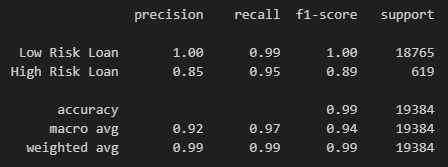

# Module 20: credit-risk-classification

## The Task
In this project, you’ll use various techniques to train and evaluate a model based on loan risk. You’ll use a dataset of historical lending activity from a peer-to-peer lending services company to build a model that can identify the creditworthiness of borrowers.

## User Story
```md
AS A credit analyst
I WANT create a model that can identify creditworthiness
SO THAT I can make informed decisions when providing loans.
```

## Acceptance Criteria
```md
Split the Data into Training and Testing Sets
  * Read the lending_data.csv data from the Resources folder into a Pandas DataFrame.
  * Create the labels set (y) from the “loan_status” column, and then create the features (X) DataFrame from the remaining columns.
  * Split the data into training and testing datasets by using train_test_split.

Create a Logistic Regression Model
  * Fit a logistic regression model by using the training data (X_train and y_train).
  * Save the predictions on the testing data labels by using the testing feature data (X_test) and the fitted model.
  * Evaluate the model’s performance by doing the following:
    - Generate a confusion matrix.
    - Generate a classification report.
    - Answer the following question: How well does the logistic regression model predict both the 0 (healthy loan) and 1 (high-risk loan) labels?
```

## Credit Risk Analysis Report
### Overview
* The purpose of this analysis was to build a model that could predict his a loan was going to be healthy or high-risk.
* Lending data used in this analysis included loan size, interest rate, borrower income, debt to income ration, number of accounts, derogatory marks, and total debt.
* Each loan in the training dataset was marked as either healthy or high-risk. Using the previously mentioned variables, the model was trained to predict this loan status.
* These were the steps followed to build and train the model:
  - The dataset was divided into x and y columns, with y being loan status, and x being all other variables.
  - The dataset was then split into training and testing data to ensure some of it was sequestered away from the model until after it was trained and ready for evaluation.
  - A logistic regression model was then trained to classify by loan status.
    * A logistic regression model is a linear combination of multiple independent variables to generate a curve of probability.
  - Predictions were then made to see how the model would classify testing data.
  - These predictions were used to generate a confusion matrix that examined the accuracy of the model's predictions

### Results
Machine Learning Model 1:


  - Precision: the higher it is, the less chance there is for False Positive cases
  - Recall: the higher it is, the less chance there is for False Naegative cases
  - F1 Score takes both Precision and Recall into account
  - Accuracy is the percentage of accurate classifications

### Summary
```
The model is very good at predicting healthy loans, with 99% accuracy, 100% precision, and 99% recall. It is not quite as good at predicting high-risk loans, with lower accuracy, 85% precision, and 95% recall. This is not too surprising, considering that high-risk loans only account for about 3% of the entire dataset. The model had ample healthy loans on which to train, and only a relatively small amount of high-risk loans.
```
For a fairly simple model, this is very accurate at predicting healthy loans. Since most loans are healthy, and only a small minority are high-risk, an increased importance should be placed on predicting high-risk loans, especially considering the potential financial losses these could incur. Currently, this model is labeling 5% of high-risk loans as healthy, and 15% of predicted high-risk loans are actually misclassified healthy loans. With the amount of money that could be lost with either of these types of errors, this model would likely need further refinement before being implemented by banks or lending companies.

## License
This project is licensed under the GNU General Public License v3.0.  
License Link:
https://www.gnu.org/licenses/gpl-3.0.en.html   
[](https://www.gnu.org/licenses/gpl-3.0)